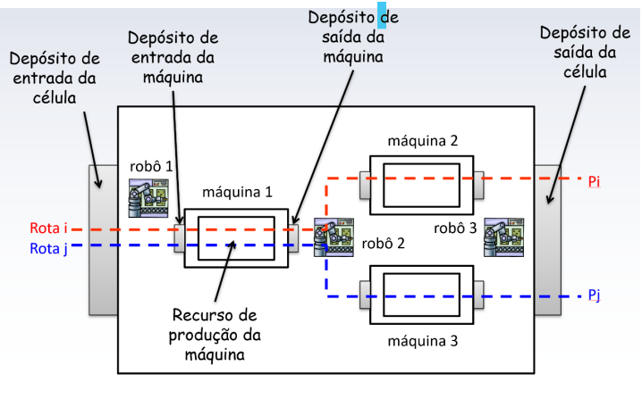
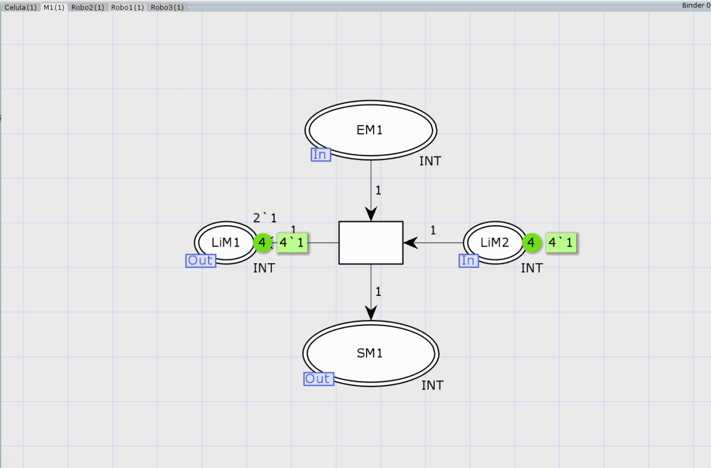
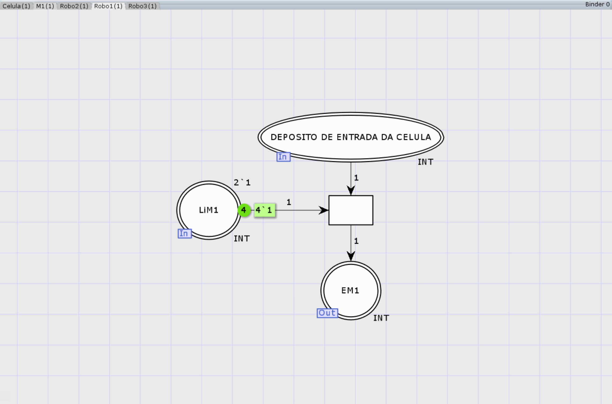
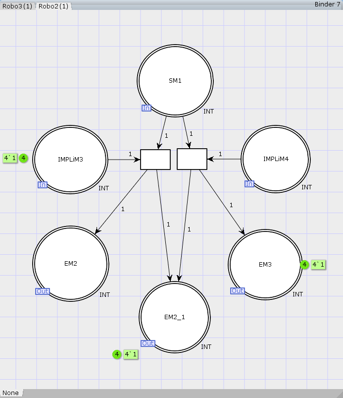
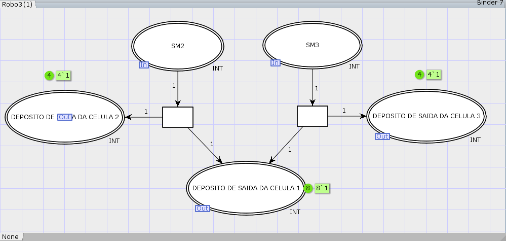
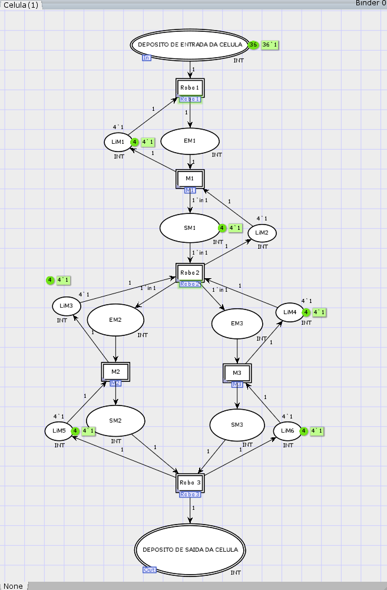
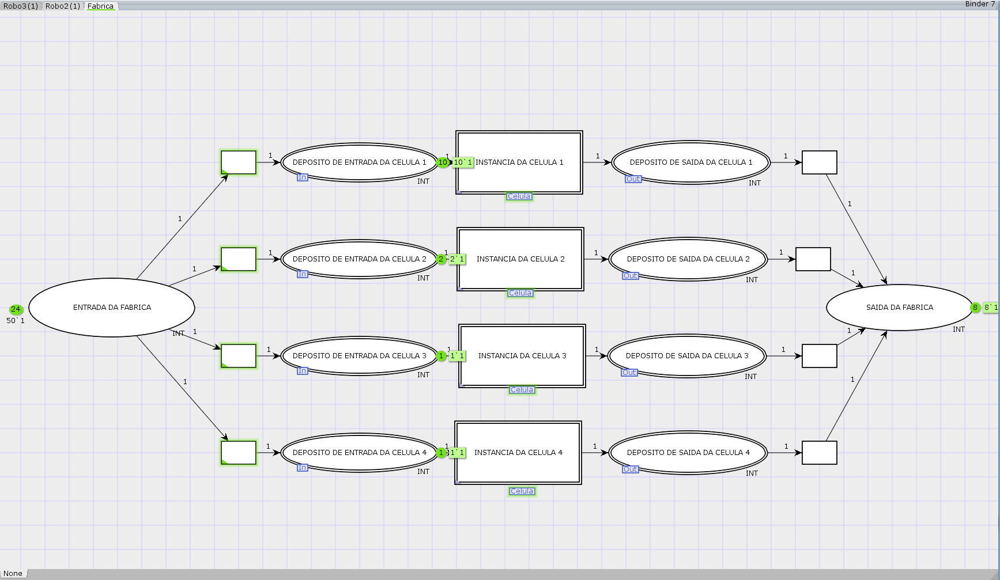

# Sistemas à Eventos Discretos
 Aplicação dos conceitos aprendidos na disciplina de Redes de Petri Coloridas.
# Contribuidores
- José Hélio de Araújo Júnior - 124212317
- Valmir Ferreira da Silva          - 119211110
# Vídeo de Demonstração
Para uma explicação detalhada do funcionamento do sistema e uma demonstração da simulação,
[Vídeo de Demonstração do Funcionamento](https://www.youtube.com/watch?v=Dyq_ksFtxUk)
## Descrição Geral do Projeto
Implementar uma sistema que representa uma fábrica com quatro células de manufatura usando os conceitos de redes de Petri coloridas aprendidos durante o curso, na ferramenta CPN Tools. Às células possuem um depósito de entrada, um depósito de saída, três máquinas e três robôs. Cada uma das máquinas dispõem de um depósito de
entrada e um depósito de saída. Os robôs são responsáveis por movem itens/produtos entre os diversos depósitos conforme a figura abaixo.

Na célula existem duas rotas de produção: 𝑖 e 𝑗. O robô 1 transporta itens/produtos entre o
depósito de entrada da célula manufatura para o depósito de entrada da máquina 1. O robô 2
transporta itens/produtos do depósito de saída da máquina 1 para os depósitos de entrada
das máquinas 2 ou 3. Por fim, o robô 3 transporta itens dos depósitos de saída das
máquinas 2 ou 3 para o depósito de saída da célula de manufatura.
### Caracterização dos componentes e subcomponentes que compõe a modelagem do sistema.
#### Rede de Petri da Máquina 0x:
Este subcomponente é modelo base de todas às máquinas, e é responsável por simular o processamento dos itens/produtos fictícios do sistema, seu funcionamente é uma abstração do sistema real e consiste em retirar um item/produto da entrada Este subcomponente é modelo base de todas às máquinas, e é responsável por simular o processamento dos itens/produtos fictícios do sistema, seu funcionamente é uma abstração do sistema real e consiste em retirar um item/produto da entrada  e dispor em sua saída do respectivo depósito associado.
entrada entrada e dispor em sua saída dos respectivos depósitos associado.

### Rede de Petri Rôbo 1
Este subcomponente é responsável por simular o transporte dos itens/produtos fictícios do sistema, seu funcionamente é uma abstração do sistema real e consiste em mover os itens/produtos da entrada da célula manufatura e dispor na entrada do depósito de máquina 1.

### Rede de Petri Rôbo 2
Este subcomponente é responsável por simular o transporte dos itens/produtos fictícios do sistema, seu funcionamente é uma abstração do sistema real e consiste em mover os itens/produtos da saída do depósito da máquina 1 e dispor na entrada do depósito de máquina 2 ou da máquina 3.

### Rede de Petri Rôbo 3
Este subcomponente é responsável por simular o transporte dos itens/produtos fictícios do sistema, seu funcionamente é uma abstração do sistema real e consiste em mover os itens/produtos da saída do depósito da máquina 2 ou da máquina 3 e dispor na saída da célula manufatura.

### Rede de Petri Célula Base 0x
Este módulo é o modelo base de todas às células de manufatura e está em um nível de hierarquia distinto dos anteriores e tem a função de encadear/interligar-os todos os sub módulos anteriores para trabalhar em conjunto/sincronia, onde temos instâncias dos robôs, máquinas e limitadores de depósitos sejam de entradas ou de saídas e representa aàs células de manufatura da fábrica.

### Rede de Petri Fábrica 
Este módulo é o nível de hierarquia mais elevado do sistema que incorpora todos os submódulos e módulos anteriores e representa uma fábrica, onde temos quatro instâncias de células e cada uma possui 3 rôbos, 3 máquinas e 6 depósitos com seus respectivos limitadores de depósitos associados, tais limitadores impõem os limites iguais a quatro itens/produtos por depósitos. Cabe ressaltar que não existe limite na entrada e nem na saída das células de manufatura tornado-a uma rede de petri com tamanho infinito.

Utilizou-se a métodologia de modelagem mista, ou seja, bottom-up e top-down. 
## Ferramentas e suas versões
 * `CPN Tools 4.0.1` 
## Como Executar o Projeto

