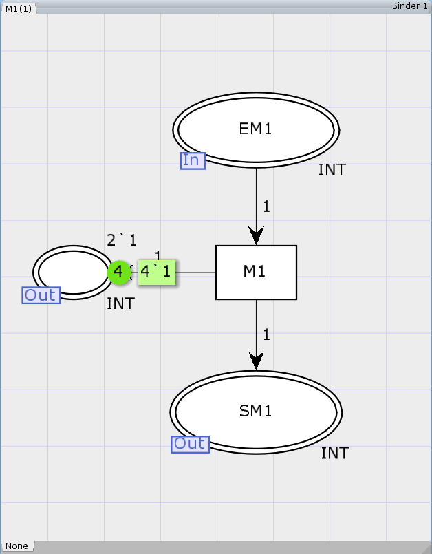
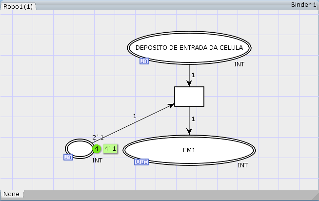
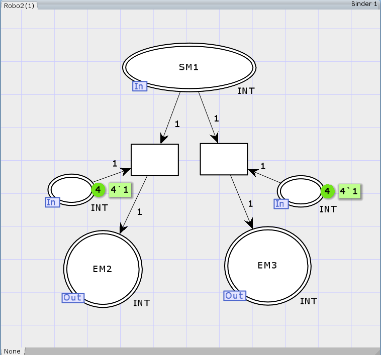
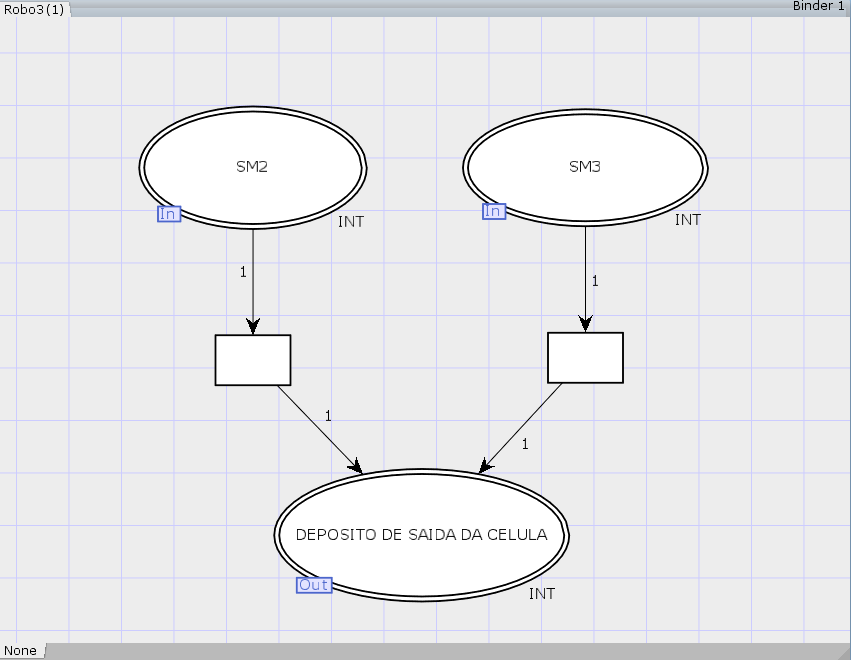

## Projeto 02 SED  REDES DE PETRI

# Modelagem de um sistema de manufatura com quatro células usando Redes de Petri Coloridas

Este projeto foi desenvolvido como atividade avaliativa da disciplina de Sistemas de Eventos Discretos (SED) que visa modelagem de um sistema de manufatura com quatro células usando Redes de Petri Coloridas

## Diagrama de alto nível da célula.

