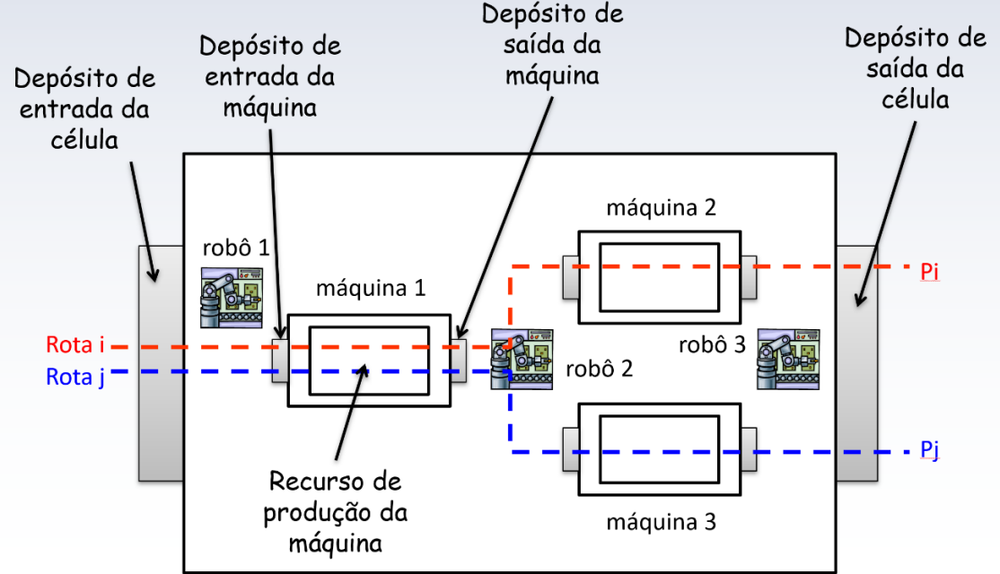

# Contribuidores

- José - 1191
- Valmir Ferreira da Silva          - 119211110

# Vídeo de Demonstração
Para uma explicação detalhada do funcionamento do sistema e uma demonstração da simulação,
[Vídeo de Demonstração do Funcionamento](https://www.youtube.com/watch?v=Dyq_ksFtxUk)
## Projeto 02 SED  REDES DE PETRI
# Modelagem de um sistema de manufatura com quatro células usando Redes de Petri Coloridas

# Vídeo de Demonstração
Para uma explicação detalhada do funcionamento do sistema e uma demonstração da simulação,
[Vídeo de Demonstração do Funcionamento](https://www.youtube.com/watch?v=Dyq_ksFtxUk)
### Diagrama de alto nível da célula.

### Rede de Petri Máquina 0x

### Rede de Petri Rôbo 1

### Rede de Petri Rôbo 2

### Rede de Petri Rôbo 3

### Rede de Petri Célula Base 0x

### Rede de Petri Fábrica 

